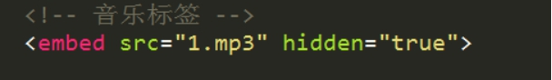
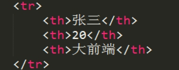
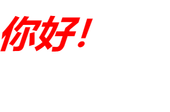
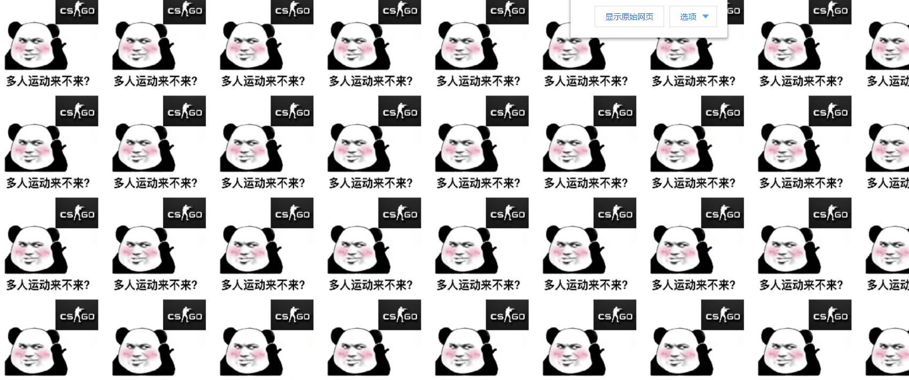
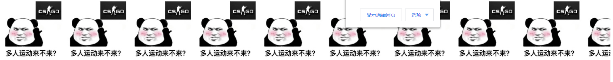
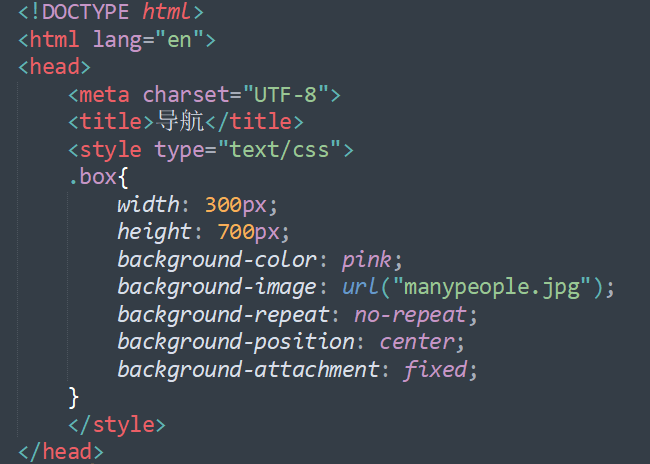
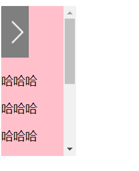

# 前端

## 认识大前端

---

**什么是前端**

前端就是将效果图生成网页，利用html+css+js等技术

---

## 认识网页

---

### 网页的组成

​	网页由文字、图片、输入框、视频、音频、超链接等组成。

---

###  Web标准

​	W3c组织（万维网联盟)

​	Html    结构标准       相当人的身体

​	Css    表现标准    相当与给人化妆 变的更漂亮

​	Js     行为标准    想当与人在唱歌，页面更灵动

---

### 常见的浏览器

​	浏览器是一个上网的客户端(软件)

​	下面是我们常见的浏览器。


---

### 浏览器的内核

​	浏览器的内核也就是浏览器所采用的渲染引擎。渲染引擎决定了浏览器如何显示网页的内容以及格式信息。	

​	浏览器的渲染引擎也是浏览器出现兼容性的根本原因

---

### 浏览器和服务器

一个发送报文，一个接收报文。然后返回浏览器要进行渲染的页面。

两者之间的关系。

---

### url地址

Url地址就是咱们说的网址。

---

## HTML

---

### 认识HTML

​	HTML是Hyper   text  markup   language的缩写

​	翻译过来就是超文本标记语言

​	超文本：超链接。（实现页面跳转）

---

### HTML的标准结构

```html
< ! doctype html>    声明文档类型
<html>               根标签
<head>            	 头标签
<title></title>      标题标签
</head>
<body>               主体标签
</body>

</html>
```

我们用一张图来形象的表示：


Html 与htm是一样的。后缀名不能决定文件格式，只能决定打开文件打开的方式。

---

### HTML的标签分类

单标签: <! Doctype html>

双标签: <html></html>   <head></head>   <title></title>

---

### HTML 标签关系分类

  包含（嵌套关系）  <head><title></title></head>     父子

  并列关系    <head></head><body></body>     兄弟姐妹

---

### 开发工具

Dw  历史悠久，设计师使用。

Sublime   轻量级    有很多好用的插件。

Webstorm  重量级    太过智能。

Sublime的常用快捷键

|        键         |     效果     |
| :---------------: | :----------: |
|        tab        | 补全标签代码 |
|   ctrl+shift+d    | 快速赋值一行 |
|   ctrl+shift+k    | 快速删除一行 |
| ctrl+鼠标左键单击 |   集体输入   |
|      ctrl+h       |   查找替换   |
|      ctrl+f       |     查找     |
|      ctrl+/       |     注释     |


---

### 标签

---

#### 注释标签    ctrl+/

```html
<!-- 坏坏 -->
```

---

#### 换行标签   br/ 

```htm
<p>文华学院</p>
<br/>
```

---

#### 水平线标签  hr/ 

```html
<p>坏坏</p>
<hr/>
```

---

#### 音乐标签embed

	-

---

#### 滚动marquee

-

---

#### 文本内容标签p p/

​	特点：上下自动生成空白行。换行不会生成空白行。

```html
<p>你好!</p>
```

---

#### 标题标签h1 h1/~h6 h6/

​	h1-h6  取值到h6

​	h1 在一个页面里只能出现一次

```html
<h1>你好！</h1>
<h2>hahah</h2>
```

---

#### 文本标签font font/

<font>文本内容</font>

---

#### 文本格式化标签

##### 文本加粗标签  strong strong/ 

​	<strong></strong>   <b></b>  工作里尽量使用strong

##### 文本倾斜标签em em/

​	<em></em>     <i></i>     工作里尽量使用em

##### 删除线标签del del/

​	<del></del>     <s></s>   工作里尽量使用del

##### 下划线标签 ins ins/

​	<ins></ins>   <u></u>    工作里尽量ins

注意：之所以工作里使用<strong></strong>  <em></em> <del></del>

<ins></ins>  是因为更有语义化。

---

#### 图片标签 img

```html

```

​	Src    图片的来源   必写属性

​	Alt    替换文本    图片不显示的时候显示的文字

​	Title   提示文本    鼠标放到图片上显示的文字

​	Width  图片宽度

​	Height  图片高度

​	图片没有定义宽高的时候，图片按照百分之百比例显示，如果只更改图片的宽度或者高度，图片等比例缩放。

---

### 路径

---

#### 相对路径

相对于文件自身出发，就是相对路径

1. 文件和图片（html文档）在同一个目录(文件夹) ，直接写文件名。

   ​

2. 图片（html文档）在文件在下一级目录里。文件夹名称+/+图片（html）名称

   ​

3. 图片（html）在文件的上一级目录里，..+/+图片（html）名称

   ​

4. 图片在文件的上一级的其他目录里，../文件夹名称/图片名称


总结：

找到下一级目录（文件夹）的图片（文件）

用 / 跳出当前目录使用../

---

#### 绝对路径

从根目录下开始到目前文件所在的位置叫做绝对路径

---

### 链接

#### 超链接


href   去往的路径（跳转的页面） 必写属性

title    提示文本   鼠标放到链接上显示的文字

target=”_self”    默认值    在自身页面打开（关闭自身页面，打开链接页面）  

Target=”_blank”   打开新页面 （自身页面不关闭，打开一个新的链接页面）

超链接优化写法：

<base target="_blank">   让所有的超链接都在新窗口打开

---

#### 锚链接

1. 先定义一个锚点

   -

2. 超链接到锚点

   -

---

#### 空链

当我们不知道链接到哪个页面的时候，可以先使用空链

-

---

### 压缩文件下载  不推荐使用

-

---

### 特殊字符


---

### 列表

---

#### 无序列表

```html
<ul>
<li></li>    列表项
<li></li>
<li></li>
</ul>
```

​		t-

type=”square”      小方块

Type=”disc”       实心小圆圈

Type=”circle”      空心小圆圈

---

#### 有序列表

```html
<ol>
<li></li>    列表项
<li></li>
<li></li>

</ol>
```

​	t-

​	type=”1,a,A,i,I” type的值可以为1,a,A,i,I

​	start=”3”  决定了开始的位置。

---

#### 自定义列表

```html
<dl>
 <dt></dt>    小标题
  <dd></dd>   解释标题
  <dd></dd>   解释标题
</dl>
```

​	-

---

#### 下拉列表

```html
<select>
<option>下拉列表选项1</option>
<option>下拉列表选项2</option>
</select>
```


属性：

Multiple=”multiple”  将下拉列表设置为多选项

Selected=”selected”  设置默认选中项目

---

#### 对下拉列表进行分组


属性:

Label=”分组名称”

---

### 常见的编码

编码的种类有很多，我们来认识一下常见的编码：

Charset   编码

Ascll

Ansi

Unicode   

Gbk 	专门针对中文来创建的一个编码

Gb2312

Big5

Utf-8   通用字符集，也是我们最常见的编码

---

### meta

---

#### 关键字


关键字的作用就是在网页中进行搜索的时候，能够匹配相关的搜索。

---

#### 网页描述


网页描述就是说明这个网页做什么的。我们看到每一个网站下面都会有关于这个网站的说明

---

#### 网页重定向


网页重定向就是网页刷新后指向的一个新网页。 5秒表示的是等待刷新的时间。

---

### link

---

#### 链接外部样式表

-

---

#### 设置ico图标

-

---

### 表格

---

#### 表格的基本框架

```html
<table>    表格
<tr>       行
<td></td> 列
<td></td>
<td></td>
</tr>
</table>
```

​	实际应用


---

#### 表格的属性

|           属性           |    命令     |
| :----------------------: | :---------: |
|           边框           |   Border    |
|           宽度           |    Width    |
|            高            |   Heigth    |
| 单元格与单元格之间的距离 | cellspacing |
|   内容与边框之间的距离   | cellpadding |
|         背景颜色         |   bgcolor   |
|         表格位置         |    align    |
|         内容位置         |   bgcolor   |

如果直接给表格用align=”center”  表格居中。如果给tr或者td使用   ，tr或者td内容居中。

---

#### 表格的标准结构

```html
<table> 
<thead>
<tr>
<td></td>
<td></td>
</tr>
</thead>
<tbody>
<tr>
<td></td>
<td></td>
</tr>
</tbody>
<tfoot>
<tr>
<td></td>
<td></td>
</tr>
</tfoot>
</table>
```

---

#### 表头和单元格合并

​	表头 <caption></caption>

​	colspan = "" 合并同一行上的单元格

​	rowspan="" 合并同一列上的单元格


----

#### 表格标题，边框颜色，内容垂直对齐

​	表格标题<th></th>用法和td一样

​	标题的文字自动加粗水平居中对齐



​	边框颜色


​	内容垂直对齐方式


​	Valign=top，middle，bottom

---

### 表单

---

#### 表单的作用

​	表单的作用是收集信息

---

#### 提示信息


---

#### 表单控件


---

#### 表单域


属性：

action:处理信息

Method=”get | post”   

Get通过地址栏提供（传输）信息，安全性差。

Post 通过1.php来处理信息，安全性高。

---

### type

---

#### 文本输入框 input type ="text"


maxlength="6"    限制输入字符长度

readonly=”readonly”  将输入框设置为只读状态（不能编辑）

disabled="disabled"  输入框未激活状态

name="username"   输入框的名称

value="大前端"     将输入框的内容传给处理文件

---

#### 密码输入框 input type ="password"


注意：文本输入框的所有属性对密码输入框都有效

---

#### 单选框 input type="radio"


只有将name的值设置相同的时候，才能实现单选效果。

checked=”checked” 设置默认选择项

---

#### 多选框 input type = "checkbox"


属性:

​	Checked=”checked” 设置默认选中项

---

#### 多行文本框 textarea


属性:

​	Cols  控制输入字符的长度。

​	Rows  控制输入的行数。

---

#### 文件上传控件 input type = "file"


---

#### 文件提交按钮 input type = "submit"


这个按钮可以实现信息提交功能

---

#### 普通按钮 input type = "button"


不能提交信息，配合JS使用

---

#### 图片按钮 input type = "image"


图片按钮可实现信息提交功能

---

#### 重置按钮 input type = "reset"


将信息重置到默认状态

---

#### 表单信息分组 fieldset


<fieldset></fieldset>    对表单信息分组

<legend></legend>      表单信息分组名称

---

### h5补充表单控件


---

## CSS

---

### CSS概念

CSS 指层叠样式表 (Cascading Style Sheets)(级联样式表)

CSS通常称为CSS样式表或者层叠样式表(级联样式表),主要用于设置HTML中的文本内容(字体，大小，对齐方式，颜色等等)、图形的外观(宽高，边框样式，边距等等)以及版面的布局等外观显示样式

---

### CSS三大特性

#### 层叠性

当多个样式作用于同一个或者同一类标签时，样式发生了冲突，总是执行后边的代码(后边的代码层叠前面的代码)。和标签调用选择器的顺序没有关系。

**示例:**


**效果:**


这里div标签虽然说是先调用的box1,但是我们执行这个一般是要按照浏览器的解析顺序来说的。浏览器从上到下进行解析，先解析box2,在解析box1，所以box1就会将box2覆盖掉。从而执行box1里面的属性。

这就叫做层叠前面的代码:

当我将它们换一个位置的时候:


效果:


先调用的是box1,但是表现的是box2属性。根据浏览器的解析顺序可以很快的得到答。

---

#### 继承性

继承性发生的前提是 **存在包含关系(嵌套关系)**

1. 文字的颜色可以继承
2. 文字的大小可以继承
3. 字体可以继承
4. 字体粗细可以继承
5. 文字风格可以继承
6. 行高可以继承

**示例：**


**效果:**



父类和子类的属性都继承了

总结起来就是文字的所有属性都可以继承。但是下面的情况不能够继承

1. h标题系列的不能够继承文字大小(一般是文字大小的两倍)但是可以继承文字的颜色

   **示例：**

   

   **效果:**

   

   我们看到h1的字体大小并没有和10px一样。

   

   浏览器默认的是h1是我们所定义的两倍大小。我们定义10px，渲染出来就是20px。这里的2em是两倍的关系

   ​

2. a标签不能够继承文字的颜色。语言默认的就是蓝色，但是可以继承文字的大小。也就是说超链接的文字大小可以改变

---

#### 优先级

​	浏览器渲染的 **默认优先级:**

​		**默认样式<标签选择器<类选择器<id选择器<行内样式<! important**

1. **默认样式时**

   ​	**示例:**


​		**效果:**

​		

​		显示的是默认的效果。

---

 2. **便签选择器, 类选择器, id选择器同时存在的时候:**

    **示例:**

    

    **效果:**

    

    显示的是id选择器的效果。

---

3. **当包含内行样式的时候:**

   **示例:**

   

   **效果:**

   

   显示的是内行样式展现的效果，说明内行样式的极别最高

---

4. **包含!important**

   **示例:**

   

   ​

   **效果:**

   

   我们看到效果是!important展示的效果。优先级是最高的。

---

#### 优先级的特点

 1. **优先级的权重会叠加:**

    **示例:**

    

    **效果:**

    

    我们看到展现的效果是标签+id选择器的效果。那么为什么不是标签+类选择器的结果咧?

    因为优先级的权重会叠加，标签类选择器+类选择器  与  标签类选择器+id选择器相比，id选择器的优先级高于类选择器，所以最后造成的就是后面的优先级高于前面的优先级。所以展示的效果是标签+id选择器的效果。

---

2. **继承的权重为0**

   **示例:**

   

   **效果:**


​	我们看到虽然 .father .son是有两个类选择器而 p.son是由一个标签和一个类组成的。那么为什么会显示 p.son的效果呢？

​	因为继承的权重为0，p标签是在div下面的，属于div的子标签，根据继承的权重为0，所以实际上father是权重加成的。所以说展现的 p.son所表现的效果。

---

### CSS的书写位置

#### 内嵌式写法

​	在head里面:


```html
<head>
    <style type = "text/css">
        样式表内容
    </style>
</head>
```

---

#### 外链式写法

​	在head里面：


```html
<link rel = "stylesheet" href = "1.css">
```

---

#### 行内样式表

​	在每一个标签内:


```html
<h1 style = "font_size:30px;color:red;">你好!</h1>
```

---

#### 三种写法的特点

​	**内嵌式写法:**

​		只作用于当前文件，并没有实现标签和结构进行分离。

​	**外链式写法:**

​		作用范围是当前站点，谁调用谁生效，范围广，实现了真正的表现和结构分离

​	**行内样式写法:**

​		作用范围仅限于当前的标签，范围小，表现和结构混在一起，一般是不推荐使用的。

---

### 选择器

---

#### 选择器的定义:

​	选择器是一个选择那个标签或者被哪个标签选择的过程

---

#### 语法:

```html
选择器{属性:值；属性:值}
```

---

#### 常见的属性

|               --               |         --         |
| :----------------------------: | :----------------: |
|              属性              |        解释        |
|           width:20px           |         宽         |
|          height:20px           |         高         |
|      background_color:red      |      背景颜色      |
|         font_size:20px         |      文本大小      |
| text_align:center\|left\|right | 内容的水平对其方式 |
|        text_indent:2em         |      首行缩进      |
|           color:red            |      文字颜色      |

___

#### 颜色的显示方式

1. 直接写颜色的名称。

   如：red,green,yellow等等

---

2. 十六进制显示颜色

   0~9, a~F等等。#000000; 前面两位代表红色，中间两位代表绿色，最后两位代表蓝色。

   越接近 f 颜色越浅


​		可以看到你好是白色。

​		越接近 0 颜色越深


​		可以看到你好是黑色的。

​		#000000和#000表示的是一样的，只要两位相同就可以省略一个。

---

3. rgb


​		rgb的取值在0~255之间

---

4. rgba


​		最后的a选项代表的是透明度值为0~1

---

#### 标签选择器

1. 语法:

   ```html
   标签:{属性:值;属性:值;}
   ```

   属性和值之间用冒号，属性和属性之间用分号进行分开。

   

2. 特点：

		标签选择器定义之后，无论选不选择，html中所有这个标签都会执行这个样式。

---

#### 类选择器[重点]

1. 语法:

   ```html
   .自定义类名{属性名:值;属性名:值;属性名:值;}
   ```


2. 特点

   谁调用，谁生效。不调用就不会生效

   一个标签可以调用多个类选择器

   多个标签可以调用同一个类选择器

   ​

3. 类选择器的命名规则

   a. 不能用纯数字或者数字开头来定义类名

   b. 不能使用特殊符号(__)下划线除外或者特殊符号开头来定义类名

   c. 不建议使用汉字来定义类名

   d. 不推荐使用属性或者属性的值来定义类名

   ​	

   下面是常见的属性:

   

---

#### ID选择器[多配合JS进行使用]

1. 语法

   ```html
   #自定义名称{属性:值;属性:值;属性:值;}
   ```

2. 特点

   一个ID选择器在一个页面只能够调用一次，调用2到3次不符合W3C规范，JS调用会出现问题。

   一个标签只能调用一个ID选择器

   一个标签可以同时调用类选择器和ID选择器

---

#### 通配符选择器

1. 语法：

   ```html
   *{属性:值;属性:值;属性:值;}
   ```

2. 特点：

   会给所有的标签都使用相同的样式

值得注意的是：

​		这种选择器一般不推荐使用，会增加浏览器和服务器的负担。

​		通配符的选择器使用的比较少。

---

#### 交集选择器

1. 语法：

   ```html
   标签+类(ID)选择器{属性:值;属性:值;属性:值;}
   ```

   

2. 特点：

   即既要满足使用了某一个标签，还要满足使用了类(id)选择器。

   如上图所示：

   必须同时有相应的标签和使用了对应的选择器这样交集选择器才能够生效。

   也就是既什么也什么

---

#### 后代选择器[重点中的战斗机]

1. 语法：

   ```html
   选择器+空格+选择器{属性:值;属性:值;属性:值}
   ```

2. 特点:

   后代选择器首先要满足包含(嵌套)关系

   父集元素在前面，子集元素在后面

   无限制隔代(无论是有多少层嵌套，只要能够满足，就会被选中)

   简单的说就是主要是它的后人，都会被选中，无论是孙子还是重孙子。

   只要能够代表标签。

   标签，类选择器，ID选择器自由组合，想怎么组合就怎么组合，只要能够表示这个标签。

   

     比如：

   ​	上面图中的 

   ​				div span{

   ​						font_size:40px;

   ​						color:red;

   ​						}	

   就是先要找满足div标签，然后再在div标签中找span标签然后再生效。

   这就是后代选择器的用法。

---

#### 子代选择器:

1. 语法:

   ```html
   选择器>选择器{属性:值;属性:值;属性:值}
   ```

2. 特点:

   直接选中下一代元素

   就是说父亲只能够选中儿子，不能够选中孙子，和后代选择器不一样。

   后代选择器只要是它的后代都能够选中。

   而子代选择器只能够选中下一代。


---

#### 并集选择器

1. 语法:

   ```html
   选择器+选择器+选择器{属性:值;属性:值;属性:值;}
   ```

   

   将所有相同的标签的属性集中写，中间用逗号隔开。

   写的标签都将满足这个属性写的效果

   这个也是标签，选择器随意的进行组合就行。

---

### 文本元素

---

#### 文本属性

|    属性     |            含义            |
| :---------: | :------------------------: |
|  font_size  |          文字大小          |
| font_weight |   文字粗细(取值100~900)    |
| font_family |         文本的字体         |
| font_style  | normal(默认)\|italic(斜体) |
| line_height |            行高            |

---

#### 文本属性的连写

​	格式：

```html
font:font_style font_weigth font_size/line_height font_family;
```

​	font后面的属性一定要按照顺序进行书写


​	注意：

​		文本属性连写，文本字体大小(font_size)和文本字体(font_family)为必须写的。

---

#### 文字字体的表达方式

1. 直接写中文名称

   

   ​

2. 写字体的英文名称

   

   ​

3. unicode编码


---

#### 查找字体的unicode编码

​	如果我们不知道字体的unicode编码我们可以到浏览器中去查找。

1. f12进行解析页面

2. 找到console

3. 第三步输入escape("宋体")注意英文的引号和括号

   

---

### 标签分类

---

#### 块元素

1. 典型代表 

   div h1~h6 p ul li

2. 特点：

   1. 独占一行
   2. 可以设置宽高
   3. 嵌套(包含)下，子块元素宽度没有定义情况下和父块元素的宽度默认一致

---

#### 行内元素

1. 典型代表

   span , a , strong , em ,del ,ins,

2. 特点

   1. 在一行上显示
   2. 不能设置宽高
   3. 元素的宽和高就是内容撑开的宽和高

---

#### 行内块元素(内联元素)

1. 典型代表

   image ,input

2. 特点

   1. 在一行上进行显示
   2. 可以设置宽和高

---

#### 三者之间的转化

1. 块元素转行内元素

```html
div,p{
display: inline;
}
```


2. 行内元素转块元素

```html
span,a{
display:block;
}
```


3. 块和行内元素转为行内块元素

```html
div,span{
display:inline-block;
}
```


---

### 伪链接类

---

#### 链接的几种状态

1. **链接的默认状态**

```html
a:link{
属性
}
a{
属性
}
```

​		这两种写法效果是一样的，都是超链接默认的状态。

---

2. **链接的访问之后的状态**

```html
a:visited{
属性;
}
```

​		链接访问之后的状态，长按不松可以看见

---

3. **鼠标放到链接上的状态**

```html
a:hover{
属性;
}
```

​		鼠标放到链接上的状态

---

4. **链接激活的状态**

```html
a:active{
属性；
}
```

---

5. **获取焦点**

```html
.focus{
属性;
}
```

​	获取焦点在后面的用的多

---

#### 链接的文本修饰

```html
text-decoration:none|underline|line-through
```

**示例:**


**效果:**


**示例:**


**效果:**


text-decoration:

none表示的是超链接没有下划线

underline表示的是有下划线

line-through表示删除线(一般不会有人用)

---

### 背景属性

---

#### 背景颜色(background-color)

**background-color:**

前面讲的很多我们就不仔细的说了

---

#### 背景图片(background-image)

**background-image**

**示例:**

```html
<!DOCTYPE html>
<html lang="en">
<head>
	<meta charset="UTF-8">
	<title>导航</title>
	<style type="text/css">
	.box{
		height: 700px;
		background-color: pink;
		background-image: url("manypeople.jpg");
		/*background-repeat: no-repeat;*/
	}
	</style>
</head>
<body>
	<div class="box">	
	</div>
</body>
</html>
```


**效果:**


backgroung-image默认的是既沿X轴又沿Y轴进行平铺。

---

#### 背景平铺(background-repeat)

**background-repeat: **

1. **repeat(默认)(沿X,Y轴平铺)**

   **示例:**

   

   **效果:**

   

---

2. **no-repeat(不平铺)**

   **示例:**

   

   **效果:**

   

---

3. **repeat-x(沿X轴进行平铺)**

   **示例:**

   

   **效果:**

   

---

4. **repeat-y(沿Y轴进行平铺)**

   **示例:**

   

   **效果:**

   

---

#### 背景定位(background-position)

1. **当只写一个值得时候，另一个值默认居中**

   **示例:**

   

   **效果:**

   

   一般来说position是有两个值，这样可以定义左上，右上等等，这样描述得方位更加得准确。

---

2. **写两个方位值的时候，默认是没有顺序要求的**

   **示例:**

   

   **效果:**

   

   中间的上边，完美符合预期。

---

3. **写两个数值的时候，第一个代表的是X轴方向，第二个代表的是Y轴方向**

   **示例：**

   

   **效果:**

   

   后面的数值实际上就是图片所在的位置，第一个代表的是X方向的位置，第二个代表的是Y轴方向的位置。坐标原点在 左左上角.

---

#### 背景是否滚动(background-attachment)

background-attachment: scroll | fixed

1. **scroll**

   **示例：**

   

   **效果:**

   

   可以看到使用scoll的话，是以div这种盒子标签为中心的。图片是在盒子的中心。scoll表示的是背景图像**会滚动**

---

2. **fixed**

   **示例：**

   

   **效果:**

   

   在浏览器的中心，这里的盒子不够大，所以看不到。我们把盒子调大一些后

   

   确实在浏览器的中心。而且图像还不会随滚动条上下进行滚动。

   所以我们看到

   scoll以盒子为中心，随滚动条上下进行滚动

   fixed以浏览器为中心，不随滚动条上下进行滚动

---

#### 背景属性的连写


连写的时候并没有顺序要求，但是url也就是图片的路径为必写的选项。

**示例:**


**效果:**

	

---

### 行高

---

#### 浏览器默认的文字大小

​	浏览器默认的文字大小为 16px

---

#### 行高的定义

​	行高是基线与基线之间的距离


​	**基线：**

​	基线是一排文字中，以最矮的画一个线，我们称为基线，也叫最基本的线。

​	**底线:**

​	底线是一排文字中，以最高的画一个线，我们称之为底线。底线又有上底线和		 下底线之分。

​	**边距:**

​	边距就是边距吧哈哈

​	我们通常计算行高，基线之间的距离不是很好算，我们就用 **文字+上下边距**

​	高度和行高是一样的。

---

#### 行高的规律

一行文字的高度和父元素的高度一致的时候，垂直居中显示

**示例:**


**效果:**


我们看到的居中只是在水平方向上进行居中，还没有在垂直居中。


当我们将行高设置为和父类元素的高度一致的时候，应该是垂直也居中的，我们来看看效果:


完美!

---

#### 行高的单位

1. **行高和文字大小之间的关系**

| 行高单位 | 文字大小 | 行高值 |
| :------: | :------: | :----: |
|   20px   |   20px   |  20px  |
|   2em    |   20px   |  40px  |
|   150%   |   20px   |  30px  |
|    2     |   20px   |  40px  |

行高的单位除了以像素为单位，行高的值和文字的大小一样

其余的都是行高单位都是与文字大小的乘积.

---

2. **行高和父元素，子元素文字大小的关系**

   | 行高 | 父元素大小 | 子元素大小 | 行高值 |
   | :--: | :--------: | :--------: | :----: |
   | 40px |    20px    |    30px    |  40px  |
   | 2em  |    20px    |    30px    |  40px  |
   | 200% |    20px    |    30px    |  40px  |
   |  2   |    20px    |    30px    |  60px  |

   总结:

   1. 不带任何单位的时候，行高是与子元素的大小相乘
   2. em 和 % 是与父元素文字大小相乘 
   3. 行高以像素为单位的时候，就是表示的行高的值

   ---

   我们来举几个例子看一下就明白了:

   1. **使用像素:**

      

      效果:

      

      我们看到行高既不和父元素相同也不和子元素相同,就是自己的像素.

      b. **使用em，%**

      

      效果：

      

      我们看到行高的值是与父元素的乘积.

   所以我们更推荐使用像素作为行高的值，这样不容易被搞晕，是多少就是多少。

---

### 盒子模型

---

#### 盒子模型的概念

​	所谓的盒子模型就是把HTML页面中的元素看作是一个矩形的盒子，也就是一个盛装内容的容器。

​	每个矩形元素都由元素的 内容，内边距(padding)，边框(border)和外边距(margin)组成。

​	生活中我们也很常见盒子模型。


---

#### 图解盒子模型的各个概念


---

#### 边框(border)

1. 边框常见的属性:

   1. border-style: 

      soild(实线) | dotted(点线) | dashed(虚线)

   2. border-color: 边框颜色

   3. border-width: 边框粗细

      ​

2. 边框的分类:

   border-top:

   border-bottom:

   border-left:

   border-right:

   ​

3. 写法示例:

   **示例:**


​		**效果:**

​			


4. 边框属性的连写:

   像上面这样的写法写起来太过于复杂，我们都使用连写。

   **示例:**

   

   **效果:**

   ​	

   和背景连写，文本属性连写一样。边框属性也是可以连写的。

   边框属性连写没有顺序，可以任意顺序，但是边框的线型必须写。

   就是实线，虚线，还是点线是必须写的。

---

5. 四个边框的属性相同时:

   当四个边框的属性相同的时候，我们可以直接  border: 后面连写属性

   这样写更加的简单而且方便.

   **示例:**

   ​	

   **效果:**

   ​	

   我们看到四个边框都是点线，颜色都是红色，而且粗细都是一样的。

---

#### 边框合并(border-collapse)

**没有使用的效果**

**示例：**

​	

**效果:**

​		

**使用了之后的效果**

示例：


效果：

​	

将单元格之间的边距合并了之后，单元格变得细了很多。

---

#### 获取焦点(focus)

**示例：**


**效果:**


​	用鼠标单击后用户名的框编程了红色，这就是focus的意义。

---

#### 获取光标的焦点(label for id)

**示例：**


**效果:**


我们看到单击用户名，输入框就编程了想要的颜色。这就叫做获取光标的焦点。

---

#### 内边距(padding)

**示例:**


**效果:**


我们看到div这个盒子的内边距和我们设置的是一样的。

**内边距的连写：**

|            写法             |                         意义                          |
| :-------------------------: | :---------------------------------------------------: |
|        padding:20px         |                 上下左右边距都是20px                  |
|      padding:20px 30px      |             上下边距是20px,左右边距是30px             |
|   padding:20px 30px 40px    |       上内边距20px 左右内边距30px 下内边距40px        |
| padding:20px 30px 40px 50px | 上内边距20px 右内右边距30px,下内边距40px 左内边距50px |

这些就是内边距的连写的意义。

---

#### 内边距撑大盒子的问题

1. **影响盒子宽度的因素**
   1. 内边距影响盒子的宽度
   2. 边框影响盒子的宽度

   **盒子的宽度 = 定义的宽度+边框宽度+左右内边距**

   ​

2. **继承的盒子一般不会被撑大**

   包含嵌套的盒子，如果子盒子没有定义宽度，给子盒子定义左右内边距一般不会撑大盒子。

   值得注意的是这里说的不会撑大盒子是从左右来说的。只要宽度不大于父类定义的宽度一般都是没有问题的。

---

#### 外边距

**示例:**


**效果:**


外边距和内边距一样也是:

margin-left | right | top | bottom

---

#### 外边距连写

|       写法       |              意义              |
| :--------------: | :----------------------------: |
|   margin:20px    |    上下左右的外边距都为20px    |
| margin:20px 30px | 上下外边距20px，左右外边距30px |

剩下的写法和内边距是一样的，就不一一的写了。

---

####  垂直方向外边距合并

当两个垂直的盒子，一个设置上边距，一个设置下边距，实际的上下边距取设置较大的那一个值。

**示例：**


**效果:**


可以看到两个盒子之间的距离是100px,而不是20px，这就是我们说的取大的值，而不是取小的值。

---

#### 嵌套的盒子外边距塌陷

​	嵌套的盒子，直接给子盒子设置垂直方向的外边距的话，就会出现盒子塌陷问题

​	**示例:**


​	**效果:**

​	

我们看到设置的是子盒子的外边距，但是父盒子也跟着一起下来了。

这就是在嵌套盒子中，设置子盒子的外边距父盒子也跟着出现塌陷的情况。

**解决办法**

​	**1.给父盒子设置边框**

​	这种方法能够奏效但是一般并不太推荐使用。

​	**2.给父盒子设置overflow:hidden**

​	这简单来讲就是溢出的问题

​	**示例:**

​	

​	**效果:**

​	

没有出现父盒子外边距塌陷的问题。

---

### 浮动布局

---

#### 文档流(标准流)

​	元素自上而下，自左而右，块元素独占一行，行内元素在一行上进行显示，碰到父集元素就换行。

​	

​		

这就是相当于一个执行标准。

块级元素纵向有序排列，行内块元素默认横向有序排列。这是默认的标准流。

那么我们如何能够让快级元素乖乖的横向有序排列呢？

---

#### 浮动(float:left | right)

​	float:left|right

​	**示例:**

​	

​	**效果:**

​	

​	这就是一个标准流，文档的布局遵循的是一个很基础的标准流。

​	下面我们再来看看使用了浮动的效果是怎样的:

​	**示例:**

​	

​	**效果:**

​	

​	我们看到红色的使用了浮动以后，就在左边浮动了起来，然后绿色的就到了红色的下面。就相当于红色的在天上飘，绿色的在地上一样的效果。

---

#### 浮动的特点

1. 元素浮动之后不占据原来的位置(脱离了标准流)

2. 浮动的盒子在一行上进行显示

3. 行内元素经过浮动以后转化为行内块元素，但是一般这种都不推荐使用。

   **转行内块元素最好使用(display:inline-block)**

---

#### 浮动的作用

1. 文本绕图

    

2. 制作导航

   ​	

3. 网页布局

   ​	

---

#### 清除浮动

---

##### 为什么要清除浮动

​	为什么要清除浮动呢？

​	当父盒子没有定义高度，嵌套的盒子浮动以后，下边的元素发生位置错误，所以我们需要清除浮动。不清除浮动的话，会给整个结构带来错误。

​	**代码:**

```html
<!DOCTYPE html>
<html lang="en">
<head>
	<meta charset="UTF-8">
	<title>小米官网案例</title>
	<style type="text/css">
		.header,.footer,.main{
			width: 500px;
		}
		.header,.footer{
			height: 100px;
			background: #000;
		}
		.main{
			/*height: 300px;*/
			background: #eee;
			margin: 10px 0;
		}
		.content{
			width: 300px;
			height: 300px;
			background: orange;
			float: left; 
		}
		.sidebar{
			width: 190px;
			height: 300px;
			background: green;
			float: right;
		}
	</style>
</head>
<body>
	<div class="header"></div>
	<div class="main">
		<div class="content"></div>
		<div class="sidebar"></div>
	</div>
	<div class="footer"></div>
</body>
</html>
```

​	**效果:**

​	正常的结构本来应该是这样的。由于我们给嵌套的盒子添加了浮动。

​	

​	结果就变成这样了	

​	

变成这样的原因是因为 main的盒子没有设置高度，导致子盒子进行浮动的时候，就相当于飘起来了，下面腾空了，也不占原来的位置，所以底部的footer就自动的上去了，看起来就是在main盒子地下，从而整个布局就发生了变化。

所以我们就需要清除浮动带来的影响。

---

##### 清除浮动的方法

​	 clear:left | right  |  both |

​	工作里用的比较多的是 clear:both

1. **额外标签法**

   ​	在最后一个浮动元素后添加标签

   ​	

   ​	

   ​	**效果:**	

   ​	

   

   ​	

2. **给父集元素使用overflow:hidden**

   ​	

   ​	如果有内容出了盒子是不能够使用这个方法的。

   ​

3. **伪元素清除浮动(超级推荐使用)**

   ​	

   ​	

   ​	**效果:**

   ​	

   这是很多网站共同的写法，比较值得推荐的

---

### CSS的初始化

​	**腾讯:**	

​	body,ol,ul,h1,h2,h3,h4,h5,h6,p,th,td,dl,dd,form,fieldset,legend,input,textarea,select{margin:0;padding:0}

​	body{font:12px"宋体","ArialNarrow",HELVETICA;background:#fff;-webkit-text-size-adjust:100%;} 

​	a{color:#2d374b;text-decoration:none}

​	a:hover{color:#cd0200;text-decoration:underline}

​	em{font-style:normal}

​	li{list-style:none}

​	img{border:0;vertical-align:middle}

​	table{border-collapse:collapse;border-spacing:0}

​	p{word-wrap:break-word}

​	**新浪:**

​	body,ul,ol,li,p,h1,h2,h3,h4,h5,h6,form,fieldset,table,td,img,div{margin:0;padding:0;border:0;}

​	body{background:#fff;color:#333;font-size:12px;margin-top:5px;font-family:"SimSun","宋体","Arial Narrow";}

​	ul,ol{list-style-type:none;}

​	select,input,img,select{vertical-align:middle;}

​	a{text-decoration:none;}

​	a:link{color:#009;}

​	a:visited{color:#800080;}

​	a:hover,a:active,a:focus{color:#c00;text-decoration:underline;}

​	这些CSS初始化我们在后面讲。

---

### overflow属性：

1. **overflow:visible 默认值，内容不会被修剪，会呈现在元素框之外**

   **示例：**

   

   **效果:**

   

   呈现在元素框之外。

   ​

2. **overflow:hidden 内容会被修剪，并且其余内容是不可见的**

   **示例:**

   

   **效果:**

   

   在框外的元素就被裁剪掉了。

   ​

3. **overflow:scroll内容会被修剪，但是浏览器会显示滚动条以便查看其余的内容**

   **示例:**

   

   **效果:**

   

   scoll是不论有没有超出边框都会有滚动条，只要是使用scoll就会有滚动条.

   ​

4. **overflow:auto 如果内容被修剪，则浏览器会以滚动条的形式显示，一遍查看其余的内容**

   **示例:**

   

   **效果: **

   

   auto只有当内容超出了边框的时候，才会有滚动条，没有超出的时候就不会有滚动条和scoll不一样。

---

### 定位

---

#### 定位方向

​	定位方向：left | right | top | bottom

---

#### 静态定位(position:static)

​	静态定位，默认值就是文档流

​	

---

#### 绝对定位(position:absolute)

​	绝对定位

​	position:absolute

​	**特点:**

1. 元素在使用绝对定位后不占据原来的位置(脱标)
2. 当元素使用绝对定位的时候，元素的定位是从浏览器出发的
3. 在嵌套的盒子中的时候。如果父盒子没有使用定位，子盒子使用的绝对定位，子盒子的位置是从浏览器出发的。如果父盒子使用了定位，子盒子使用的绝对定位的时候，子盒子的位置是从父盒子出发的
4. 给行内元素使用绝对定位后，转为行内块元素(一般不推荐这样使用。我们更推荐使用display:inline-block来进行内块的转化)

---

#### 相对低位(position:relative)

​	相对定位:

​	position:relative

​	**特点:**

1. 使用相对定位，位置从自身出发
2. 使用相对定位后，还是占用原来的位置
3. **子绝父相(父元素使用相对定位，子元素使用绝对定位)**
4. 行内元素使用相对定位不能够转化为行内块元素

---

#### 固定定位(position:fixed)

​	固定定位:

​	position:fixed

​	**特点:**

1. 固定定位之后，不占据原来的位置(脱标)
2. 元素使用固定定位之后，位置从浏览器出发
3. 元素使用固定定位之后，会转化为行内块(我们还是不推荐这样转化为行内块，转化为行内块最好使用display:inline-block)

---

#### 子绝父不一定相

​	之前我们总是说子绝父相，但是在实际开发中，子绝父是不一定相的。

​	父类是相对定位，固定定位，绝对定位等等，除了静态定位之外，字类都是相对父类来进行定位的

​	如果第一个父类并没有采用相对定位，那么就看这个父类上面的一个，采用了定位就以这个为准，如果所有的父类都没有采用定位的话，子类就会以浏览器作为定位。

​	所以说子绝父是不一定相的。

---

###  定位的盒子居中显示

​	如何让定位的盒子居中显示呢？

1. **margin: 0 auto; 只能够让标准流的盒子居中对齐**

2. 定位的盒子居中

   先左右走父盒子一半的50%，在向左走子盒子的一半(margin-left=负值)

   

   **注意:**

   ​	margin:0 auto 只能够让标准流的盒子居中，不能够让浮动的盒子居中

----

### 标签包含规范

   	1. div可以包含所有的标签
   	2. p标签不能够包含 div p等标签
		3. h1 可以包含 p div 等标签
		4. 行内元素尽量包含行内元素，行内元素不要包含块元素


---

### 规避脱标流

​	脱标流虽好可也不能够贪杯哦，我们在日常开发的时候能够不使用脱标流就不使用脱标流。

 	1. 尽量使用标准流
		2. 标准流使用不了的使用浮动
		3. 浮动解决了不了的使用定位

由于浮动，定位都脱离了标准流，会对网页的布局造成一定的影响，在以后网页的布局中会优先考虑：标准流>浮动>定位

---

### 规避脱标流的方法

​	**使用margin-left:auto规避脱标流**

​	margin-left:auto  让盒子左侧充满

​	margin-right:auto  让盒子右侧充满

​	这里的auto是自动的意思，就是一直往左边冲，直到边界处停止。

​	这也是为什么margin:0 auto会居中的原因，左边往左边冲，右边往右边冲，最后就是在中间停止了。

---

### 图片和文字居中对齐

​	**vertical-align:middle让行内，行内块元素设置垂直距离**

​	vertical-align:middle 常与 display:inline-block配合使用，表格对此属性最敏感 

---

## JS基础篇

---

### javascript的历史

​	 94年网景公司   研发出世界上第一款浏览器。

  	95年 sun公司   java语言诞生

 	 网景公司和sun合作。

  	Java+script   ===> javascript

---

### javascript和ECMAScript的关系

​	 ECMAScript是一种由Ecma国际前身为欧洲计算机制造商协会,英文名称是European Computer Manufacturers Association，制定的标准。

​	JavaScript是由公司开发而成的，公司开发而成的一定是有一些问题，不便于其他的公司拓展和使用。所以欧洲的这个ECMA的组织，牵头制定JavaScript的标准，取名为ECMAScript。

​	**简单来说ECMAScript不是一门语言，而是一个标准。符合这个标准的比较常见的有：JavaScript、Action Script（Flash中用的语言）。**就是说，你JavaScript学完了，Flash中的程序也会写了。

​	ECMAScript在2015年6月，发布了ECMAScript 6版本，语言的能力更强。但是，浏览器的厂商不能那么快的去追上这个标准。这些新的特性，我们就业班的深入，也会给大家介绍。

---

### JS的简单介绍

  1. js是一种运行在客户端的网络编程语言
     	

  2. 组成部分：
     	1. ECMAScript   js标准
     	2. Dom  通过JS操作网页元素
     	3. om   通过API操作浏览器
     	

  3. 特点：
         1. 简单易用
         2. 解释执行
         3. 基于对象 

		4. 作用：

     表单验证
    
     轮播特效
    
     开发简单的游戏

---

### JS的书写位置

​	和css一样，js的书写位置分为**内嵌式** 和 **外链式**

​	**内嵌式：**

​	

​	**外链式：**

​	 

​	先创建一个js文件，然后再通过src将外部文件导入

​	**值得注意的是:**

 		a. 写JS代码的时候，分号不能够省略

​		 b. 推荐将JS代码写在html结束的标签后面。JS没有执行完成的话，是不会继续向下进行执行的，所以如果将JS放在前面的话，那么会一直执行JS导致后面的html不能够解析和执行。

​		c. 推荐将多个JS文件合并为一个文件

---

### 输出消息的几种方式：

---

#### alret("内容") 在页面弹出一个对话框，早期的JS调用

​	

---

#### confirm() 在页面内弹出一个对话框。常配合if判断使用

​	

---

#### console.log() 将信息输入到控制台，用于JS调试

​	

---

#### prompt()弹出对话框用于接收用户的信息

​	

---

#### document.write()在页面输出消息


值得注意的是:

​	document.write不仅能够输出信息还能够输出标签

---

### 转义字符

| 字符 |   意义   |
| :--: | :------: |
| \''  | 转双引号 |
|  \'  | 转单引号 |
|  \n  |  转换行  |
|  \r  |  转回车  |

---

### JS的注释

 	1. 单行注释: //
		2. 多行注释: /*  */

---

### 数据类型

---

#### 数字类型

​	简单的数字类型包含，整数，小数，负数，等等一些列的数字类型。

​	

​	数字类型的表示方式：

​	OX开头的表示十六进制

​	O开头表示八进制

​	具体见组成原理中有详细的描述

---

#### 字符串 string

​	和在python中的一样，单引号或者双引号括起来的都是字符串。

---

#### 布尔数据类型 booleam

​	布尔数据类型只有两个一个是ture 一个是false，实际上大于0 的表示的是ture，

等于0的表示的false

----

#### 数据类型判断(typeof())

​	

---

### 数据类型的转换

---

#### 数字类型转换为字符串类型

1. String()

   ​	

   ​

2. 变量.toString()

   ​	

   ​

​            这两者并没有什么实质上的区别，效果都是一样的，就是写法不一样而已，根据自己的喜好来使用就行。

---

#### 字符串转化为数字类型

1. **Number()**

   ​	

   1. 纯数字类型的字符串转化之后得到的是数字，也是数字类型.

   2. 非纯数字类型的字符串如"123abc"，转化之后得到的是NaN，同时也是数字类型。(NaN的意思就是，不知道转化成为什么好，JS中统一的命名为NaN)

   3. 小数类型的字符串，转换之后得到的是原来的数字。

      ​

2. **parseInt()**

   

   1. 纯数字类型的字符串转化之后得到的是数字，也是数字类型。
   2. 非纯数字类型的字符串如:"123abc"，转化之后得到的是前面得数字123，但是如果以非数字开头的话，就是NaN，如:"abc123"转化之后就是NaN
   3.  **小数类型字符串**，**转换之后向下进行取整** 。例如：0.78取整0。1.98取整1。

3. **parseFloat()**

   ​	

   ​	

   1. 整数数字类型的字符串，转换之后得到的整数数字。
   2. 数字开头的字符串，转换之后得到的是前边的数字。
   3. 非数字开头的字符串，转换之后得到的是NaN。
   4.  **小数类型的字符串**，转换之后得到的是 **原数字。**

---

#### 转布尔类型

​	转布尔类型比较简单 ，采用Boolean()


​	数字和字符串转化完之后为true

​	undefined、null、0 转化完成之后为 false

---

### 运算符

---

#### 比较运算符

​	> ,< , >=, <=, !=, ==	

---

#### 算术运算符

1. **+**

   a. 两个数字类型变量相加得到的是一个数字类型的变量

   b. 一个数字类型的变量和一个字符串相加，得到的是一个字符串

2. **-**

   a. 一个数字类型和一个数字字符串相减，得到的是一个数字类型

   b. 一个数字类型和一个非数字类型的字符串相减，得到的是一个数字类型

3. **/**

   一个数字类型和一个字符串相除，得到的是一个数字类型

   一个数字类型和一个非数字类型的相除，得到的是一个数字类型.

   0作为出除数的时候，得到的结果无限大，但也是一个数字类型

4. **%**

   取余。这在很多语法中都有讲到过。

---

#### 逻辑运算符

​	逻辑运算只有两个结果，一个为True一个为False

1. **&&:**

   两个都为True的时候，最后的结果才为True.

2. **||:**

   只要有一个表达式为True，最后的结果就为True

3. **!:**

   与表达式相反的结果就是非

---

#### 等号运算符

1. **=**

   就是普通的赋值运算符

2. **==**

   两个等号只判断内容是否相同，不判断数据类型是否相同

3. **===**

   三个等号既判断数据内容是否相同也判断数据类型是否相同

4. **!=**

   只判断数据内容是否相同，不判断数据类型是否相同

5. **!==**

   不全等于，不仅判断数据内容是否相同，还判断数据类型是否相同

---

#### 三元表达式

​	表达式？结果1：结果2；

​	表达式成立则执行结果1，不成立则执行结果2


### Date()对象

---

​	Date对象用于处理日期和时间

​	

---

### Math()对象

---

1. **ceil()(si:l)天花板,向上取整**

   

   Math.ceil() 我们叫做天花板函数，指向上取整。

   如果是整数的话，就是这个数本身。

   例如：5取整为5。3取整也是为3的。

   如果是小数的话，就是向上进行取整

   例如：5.56取整的话为6。5.17取整的话也是为6的


2. **floor()向下取整**

   

   如果是整数的话，取整后还是这个整数。

   如果是小数的话取整是向下进行取整的

   ​

3. **max(n1,n2)取两个数的最大值**

   

   ​

4. **min(n1.n2)取两个数的最小值**

   

   ​

5. **pow(n1,n2)返回n1的n2次 方**

   

   ​

6. **round(n1)进行四舍五入**

   

   ​

7. **random()返回0~1之间的随机数**

   

   ​

---

### if选择

​	if条件选择的使用方法和C语言中的是一样的。这里就不再仔细的讲述了。

---

### switch

​	语法和C语言中的语法是一样的。

```javascript
switch(n){
        case 1:
        执行此处的代码;
        break;
    	case 2:
        执行此处的代码;
        break;
    default:
        执行此处的代码;
        break;
}
```

值得注意的是：switch后边的变量和case后边值的数据类型必须保持一致。

---

### 自增自减

​	和C语言中一模一样，什么都没有改变。

1. **没有参与运算的情况下**

   ++i ,i++都是在变量的基础上加1

2. **在参与运算的情况下**

   

---

### while循环

```javascript
while(条件){
    循环执行的语句;
}
```

如果while后边条件表达式为true，循环语句一直执行，直到while后边条件表达式的值为false，循环终止跳出循环


---

### Do while 语句

```javascript
do{
    循环执行的语句;
}while(条件表达式)
```

不管循环成不成立都会先执行do里面的语句。

所以不管怎样，循环都会执行一次

---

### for循环

```javascript
for(var i=1;i<length;i++)
{
    循环代码
}
```


---

### break和continue

​	在JavaScript中，break和continue的作用范围和C语言中的是一样的。

​	break表示的是跳出循环。

​	continue表示的是退出当前一次循环，下一次还是会执循环体中的代码

---

### 变量的作用域

- 变量有**局部变量** 和 **全局变量** 之称
- 在JS中可以使用关键字 **var 为函数变量设定作用域。**如果在**某个函数中使用了var ，那么这个变量就会被视为一个局部变量**，它只存在于这个函数的上下文中。相反如果**没有使用var 那么这个变量将会被视为全局变量**，在任何地方都可以被调用。如果脚本里存在一个与之同名的全局变量，**这个函数就会改变那个全局变量的值。**

----

### 数组

---

#### 创建数组

​	

---

#### 数组赋值

​	

---

#### 数组遍历

​	

---

#### 数组的合并


---

#### .join()返回一个字符串


---

### 函数

#### 函数的定义

通过function 关键字 和方法名可自定义一个函数如下


#### 函数的调用


函数的使用，返回值等等问题和我们之前在C语言中学习的是一样的，所以在这里也不再深入的讲解了，因为有了前面的基础，学起来都比较好学一些。

---

### 对象(object)

---

#### 对象的意义

- 对象是一种非常重要的数据类型

- 对象是自包含的数据集合。包含在对象中的数据可以通过 **属性** 和 **方法** 的方法进行访问。

- **属性：**

  属性只是隶属于某个特定对象的变量

- **方法：**

  方法是某个特定对象才能够调用的函数

---

#### 内建对象

- 内件对象就是使用 JS 自带的一些对象创建实例化的对象。像，Array(),Date(),等等。
- 在编写JS脚本的时候，内建对象可以帮助我们快速的完成任务。

---

#### 宿主对象

- 除了内建对象，我们还可以使用一些 JS 脚本里已经定义好了的其他的对象。这些对象 **不是由JS 本身提供的** ， **而是由它的运行环境决定的** 。具体到Web 应用，这个环境就是浏览器。
- **由浏览器提供的预定义的对象** 我们称之为宿主对象

---

## DOM

---

### DOM

- **D**

  document(文档) 。当创建一个网页并把它加载到Web浏览器的时候，DOM 就在幕后悄然而生， **把你编写的网页文档转换成为一个文档对象**

- **O**

  objects(对象)。包含 **用户自定义对象** ， **内建对象** ， **宿主对象**也就是我们常说的一些对象。

- **M**

  model(模型)。将一份文档表示为一棵树。就是M的作用。

  **例如：**

  

  **树：**

  

  这和我们在数据结构中学习的树是有些相像的。应该说就是同一种数据类型。

---

### node (节点)

---

#### node mean(节点定义)


---

#### element node (元素节点)


---

#### text node(文本节点)


---

#### attribute node(属性节点)


---

### get  element (获取元素节点）

- 我们可以通过 **三种方法** 。

  **元素ID**

  **标签名字**

  **类名字**

#### getElementById()

- 文法：

  ```javascript
  document.getElementById(id)
  //id填写的是id类的类名
  ```


- 这个方法返回 **与给定Id属性值的元素节点对应的对象**。事实上文档中的每一个元素都是一个对象。

---

#### getElementsByTagName()

- 文法：

  ```javascript
  document.getElementsByTagName(tag)
  //tag填写的是便签的名字
  ```

- 返回的是一个 **数组** ，编写脚本的时候千万不要和之前的弄混了

- ```javascript
  document.getElementsByTagName("*").length
  ```

  这样的作法可以直到文档中到底有多少个元素节点。

  *表示通配符，也就是说每个元素都能够被匹配上。

---

#### getElementsByClassName()

-  **文法**

  ```javascript
  document.getElementsByClassName(classname)
  ```

- 返回的是具有同一个类名的所有节点的数组。

- 还可以查找 **多个类名**

  ```javascript
  document.getElementsByClassName("important,sale")
  //只需要中间使用空格隔开即可，这里查找的是具有 important 和 sale 的类名的节点的数组
  ```

- 还可以自定义搜索的起点

- 

  

---

### get and setAttribute (获取和设置属性)

---

#### getAttribute()

- **文法**

  ```javascript
  object.getAttribute()
  //这个函数只有一个参数，就是我们要查询属性的名称	
  ```

- **注意**

  

  也就是说此方法只能够 **被节点对象进行调用**

---

#### setAttribute()

- **文法**

  ```javascript
  object.setAttribute(attribute,value)
  //一共两个参数，元素属性和值
  ```

- **注意**

  

---

​	83页


---

## 案例

---

### 导航栏示例：

**代码:**

```html
<!DOCTYPE html>
<html lang="en">
<head>
	<meta charset="UTF-8">
	<title>导航</title>
	<style type="text/css">
	.nav{
		height: 40px;
		background-color: pink;
		text-align:center;
	}

	a{
		display: inline-block;
		height:40px;
		width: 120px;
		color: yellow;
		text-decoration: none;
		font:400 25px microsoft yahei;
	}
	a.public{
		color: red;
	}
	a:hover{
		text-decoration: underline;
		background-color: #23ADE5;
	}

	</style>
</head>
<body>
	<div class="nav">
		<a href="#" class="public">天猫</a>
		<a href="#" class="public">聚划算</a>
		<a href="#" class="public">头条</a>
		<a href="#" class="public">阿里旅行</a>
		<a href="#">电器城</a>
		<a href="#">淘抢购</a>
		<a href="#">苏宁易购</a>
		<a href="#">智能生活</a>
		<a href="#">超市</a>
	</div>
</body>
</html>
```

**效果:**


---

### 表单控件案例

**示例:**

```html
<!DOCTYPE html>
<html lang="en">
<head>
	<meta charset="UTF-8">
	<title>表单控件</title>
	<style type="text/css">
		.username{
			border: 0 none;  /*去掉边框*/
			outline-style: none; /*去掉轮廓线*/
			background: yellow;
			border:4px dotted pink;
		}

	</style>
</head>
<body>
	用户名:<input type="text" class="username"><br><br>
	邮箱:<input type="text">
	
	
</body>
</html>
```

**效果:**

​	

---

### 新浪导航栏案例

**示例:**

```html
<!DOCTYPE html>
<html lang="en">
<head>
	<meta charset="UTF-8">
	<title>新浪导航案例</title>
	<style type="text/css">
		.nov{
			height: 50px;
			border-top: orange 3px solid;
			border-bottom: 1px solid #333;
		}

		.nov_cov{
			width: 1000px;
			margin: 0 auto;
		}

		a{
			font:18px/50px 微软雅黑;
			text-decoration: none;
			color:#333;
			display: inline-block;
			height: 50px;
			padding: 0 50px;
		}

		a:hover{
			color: blue;
			background: #eee;
		}
	</style>
</head>
<body>
	<div class="nov">
		<div class="nov_cov">
			<a href="#">设为首页</a>
			<a href="#">手机新浪网</a>
			<a href="#">移动客户端</a>
		</div>
	</div>
</body>
</html>
```

**效果:**


---

### 小米商城案例

```html
<!DOCTYPE html>
<html lang="en">
<head>
	<meta charset="UTF-8">
	<title>小米官网案例</title>
	<style type="text/css">
		.father{
			width: 1226px;
			margin: 20px auto;
			position: relative;
		}
		.one{
			position: absolute;
			top: 0;
			left: 0;
		}
		.two{
			position: absolute;
			left: 234px;
			bottom: 209px;
		}
		.three{
			position: absolute;
			right: 0;
			bottom: 209px;
		}
	</style>
</head>
<body>
	<div class="father">
		
		<div class="one"></div>
		<div class="two"></div>
		<div class="three"></div>
	</div>

</body>
</html>
```

**效果:**


---

### js图片库

```html
<!DOCTYPE html>
<html lang="en">
<head>
    <meta charset="UTF-8">
    <meta name="viewport" content="width=device-width, initial-scale=1.0">
    <title>photostore</title>
    <style type="text/css">
    #define{
        width: 350px;
        height: 400px;
    }
    </style>
</head>
<body>
    <h1>Wellcome photostore</h1>
    <ul>
        <li><a href="./image/photo1.jpg" onclick="showpic(this); return false;" title="That's a gilr!"> photo1</a></li>
        <li><a href="./image/photo2.jpg" onclick="showpic(this); return false;" title="The best band that I like is New Pants!">photo2</a></li>
        <li><a href="./image/photo3.png" onclick="showpic(this); return false;" title="So curt a gilr!">photo3</a></li>
        <li><a href="./image/photo4.jpg" onclick="showpic(this); return false;" title="Coming on young man!">photo4</a></li>
    </ul>
    
    <P id = "description">Choose you imageputer</P>

    <script type="text/javascript" src="./js/photo.js"></script>
</body>
</html>
```

```javascript
function showpic(whichpic) {
    var source = whichpic.getAttribute("href");
    var placeholder = document.getElementById("define");
    var title_value = whichpic.getAttribute("title");
    var description = document.getElementById("description");
    placeholder.setAttribute("src",source);
    description.firstChild.nodeValue = title_value;
}

```

**解释：**

对几处代码做关键的解释：

​	

---

## 实际开发中常见的错误

---

### 权重对标签的影响

​	

 

​	